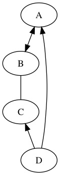
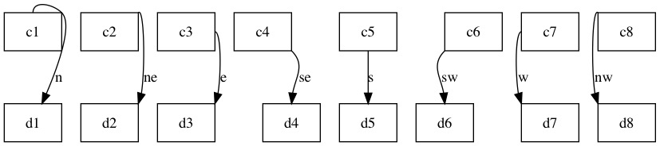

第一章 快速入门
==============================================================================

1.1 画一个简单的有向图
------------------------------------------------------------------------------

Graphviz 编译的源文件是 dot 文件，把如下的代码保存到 graph01.dot 文件。

.. code-block:: none
    :linenos:
    :caption: graph01.dot
    :name: Graph 01

    digraph G {
        main -> parse -> execute;
        main -> init;
        main -> cleanup;
        execute -> make_string;
        execute -> printf;
        execute -> compare;
    }

使用命令 :code:`dot -Tjpg graph01.dot -o graph01.jpg` 编译，可以得到名为 graph01.jpg
的图片，图片内容如下所示。

.. image:: _static/examples/graph01.jpg

在上述的 dot  文件中，定义了一个名为 G  的有向图（ digraph  是有向图的意思），\
有向图的具体内容紧随定义后的花括号内。花括号体内，定义了点( node )到点的线\
段( edge )。每一行，以英文分号(;)结尾的整行，定义的是一条连接两个或多个点的有\
向线段，比如 :code:`main -> parse -> execute` 定义了一条历经三个点\
(:code:`main`, :code:`parse`, :code:`execute`)的有向线段。 :code:`->` 定义了线\
段的方向。

1.2 让有向图更复杂点
------------------------------------------------------------------------------

Graphviz 可以给点(node)或者线(edge)添加格式。

.. code-block:: none
    :linenos:
    :caption: graph02.dot
    :name: Graph 02

    digraph G {
        main [shape=box];
        main -> parse [weight=8];
        parse-> execute;
        main -> init [style=dotted];
        main -> cleanup;
        execute -> {make_string, printf};
        init -> make_string;
        edge [color=red];
        main -> printf [style=bold, label="100 times"];
        make_string [label = "make a\nstring"];
        node [shape=box, style=filled,color=".7, .3, 1.0"];
        execute -> compare;
    }

使用命令 :code:`dot -Tjpg graph02.dot -o graph02.jpg` 可以得到如下的图片：

.. image:: _static/examples/graph02.jpg

1.3 支持中文
------------------------------------------------------------------------------

Graphviz 支持 UTF8 下的中文。

.. code-block:: none
    :linenos:
    :caption: graph03.dot
    :name: Graph 03

    digraph G {
        魔兽争霸3 -> XHero;
        魔兽争霸3 -> 超级战舰;
        XHero -> Footman;
        Footman -> 刀塔;
    }

使用命令 :code:`dot -Tjpg graph03.dot -o graph03.jpg` 可以得到如下的图片：

.. image:: _static/examples/graph03.jpg

1.4 指定有向图箭头方向
------------------------------------------------------------------------------

对每条边设置 dir 参数，可以设置每条线的方向。

.. code-block:: none
    :linenos:
    :caption: graph04.dot
    :name: Graph 04

    digraph html {
        A -> B [dir = both];
        B -> C [dir = none];
        C -> D [dir = back];
        D -> A [dir = forward];
    }

编译可以得到如下的图片：

1.5 控制边的起点位置和终点位置
------------------------------------------------------------------------------

.. code-block:: none
    :linenos:
    :caption: graph07.dot
    :name: Graph 07

    digraph G {
        node [shape=box];
        c1:n -> d1 [label=n];
        c2:ne -> d2:ne [label=ne];
        c3:e -> d3:ne [label=e];
        c4:se -> d4:n [label=se];
        c5:s -> d5:n [label=s];
        c6:sw -> d6:n [label=sw];
        c7:w -> d7:nw [label=w];
        c8:nw -> d8:nw[label=nw];
    }

编译可以得到如下的图片：

1.6 内置颜色
------------------------------------------------------------------------------

这里列出了基本的颜色，更多信息请参看 `Graphviz Colors`_ 和 `Graphviz Attrs`_ 。

.. _Graphviz Colors: http://www.graphviz.org/doc/info/colors.html
.. _Graphviz Attrs: http://www.graphviz.org/doc/info/attrs.html#k:color

