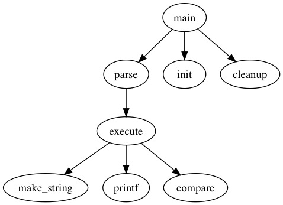
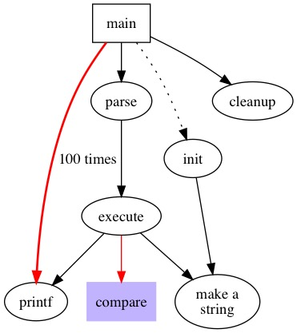
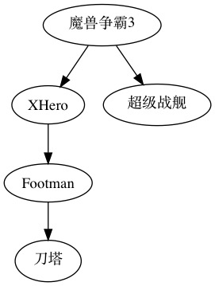

第一章 快速入门
==============================================================================

1.1 画一个简单的有向图
------------------------------------------------------------------------------

Graphviz 编译的源文件是 dot 文件，把如下的代码保存到 graph01.dot 文件。

.. code-block:: none
    :linenos:
    :caption: graph01.dot
    :name: Graph 01

    digraph G {
        main -> parse -> execute;
        main -> init;
        main -> cleanup;
        execute -> make_string;
        execute -> printf;
        execute -> compare;
    }

使用命令 `dot -Tjpg graph01.dot -o graph01.jpg` 编译，可以得到名为 graph01.jpg
的图片，图片内容如下所示。

1.2 让有向图更复杂点
------------------------------------------------------------------------------

Graphviz 可以给点(node)或者线(edge)添加格式。

.. code-block:: none
    :linenos:
    :caption: graph02.dot
    :name: Graph 02

    digraph G {
        main [shape=box];
        main -> parse [weight=8];
        parse-> execute;
        main -> init [style=dotted];
        main -> cleanup;
        execute -> {make_string, printf};
        init -> make_string;
        edge [color=red];
        main -> printf [style=bold, label="100 times"];
        make_string [label = "make a\nstring"];
        node [shape=box, style=filled,color=".7, .3, 1.0"];
        execute -> compare;
    }

使用命令 `dot -Tjpg graph02.dot -o graph02.jpg` 可以得到如下的图片：

1.3 支持中文
------------------------------------------------------------------------------

Graphviz 支持 UTF8 下的中文。

.. code-block:: none
    :linenos:
    :caption: graph03.dot
    :name: Graph 03

    digraph G {
        魔兽争霸3 -> XHero;
        魔兽争霸3 -> 超级战舰;
        XHero -> Footman;
        Footman -> 刀塔;
    }

使用命令 `dot -Tjpg graph03.dot -o graph03.jpg` 可以得到如下的图片：

